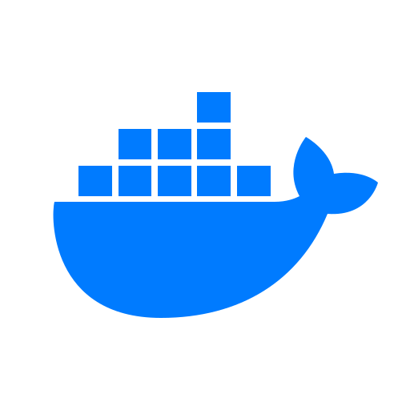

<h3 align="center">♛ ♜ ♞</h3>

- ### **🏫 I'm a Computer Science student.**
- ### 🚀 **I am a Senior Software Engineer at [Kroolo](https://kroolo.com/)**
- ### ⚡ **I used to work as a Software Engineer at [Rivi](https://rivi.co/)**
- ### 💼 **I was an Associate Software Engineer at [Decathlon](https://www.decathlon.in/)**
- ### 🤔 **I'm interested in**
    - &nbsp;**λ**&nbsp; Computer Science
    - &nbsp;**∮**&nbsp; Math
    - 🧠 Biology
    - 🔑 Crypto **ETH | BTC | XRP | ADA | SOL**
- ### 🦄 **I am working on**
    - **[Hyperion](https://github.com/troglodytto/hyperion)** - A Simple HTTP/1.1 Client/Server
    - **[Zeno](https://github.com/troglodytto/zeno)** - A minimal x86 Kernel
    - **[Oxytorrent](https://github.com/troglodytto/oxytorrent)** - A simple torrent client written in Rust
- ### 🎵 **What I listen to, on [Spotify](https://open.spotify.com/user/qkr5jlyvoo4c35vhptmnohftw)**

<table width="100%">
<tr><td width="50%"><a href="https://open.spotify.com/playlist/03IuhUWLUpxoONvlvVZklA"><b>&#10022; Exterminate</b></a> Riddim and heavy dubstep</td><td width="50%"><a href="https://open.spotify.com/playlist/7wDj61jPRxP5p2bYthXPuS"><b>&#10022; Trancendence</b></a> Melodic bass, the euphoric end</td></tr>
<tr><td width="50%"><a href="https://open.spotify.com/playlist/2SHKPMoOB8DDxpsaswN1YI"><b>&#10022; Brainbridge</b></a> Mid-tempo and experimental bass</td><td width="50%"><a href="https://open.spotify.com/playlist/5TPNh7Rkx9yzO2jmwE8c3y"><b>&#10022; Symphony</b></a> Film and game scores</td></tr>
<tr><td width="50%"><a href="https://open.spotify.com/playlist/1hGiv7IByMuNK1jDFdjHhQ"><b>&#10022; Daylight</b></a> Pop and indie, for daylight</td><td width="50%"><a href="https://open.spotify.com/playlist/0jaeSvwfAWFM9curJuyIpE"><b>&#10022; Classical</b></a> Orchestral, the standard repertoire</td></tr>
<tr><td width="50%"><a href="https://open.spotify.com/playlist/1WaNNXemjGdd7hHVQnthXS"><b>&#10022; War against the City</b></a> Arcane and League, plus harder vocal tracks</td><td width="50%"><a href="https://open.spotify.com/playlist/04QKyvWM8YIL2UumG4Vixj"><b>&#10022; Hollow</b></a> Darker electronic, vocal and instrumental</td></tr>
<tr><td width="50%"><a href="https://open.spotify.com/playlist/3Ei6GHW9PXX6DW85wNBgxr"><b>&#10022; Abyss</b></a> Ambient and lo-fi, for working</td><td width="50%"><a href="https://open.spotify.com/playlist/64P3hOQeaOBl46Q1yIHQJf"><b>&#10022; Neon</b></a> Synthwave and retrowave</td></tr>
</table>

## Pandora's Box 🔥

    
    
    
    
    
    
    
    
    
    
    
    
    
    
    

## Learning goals 👓

    
    
    

## Stats

</img>
</img>

## Connect

  
  
  
  
  

    

